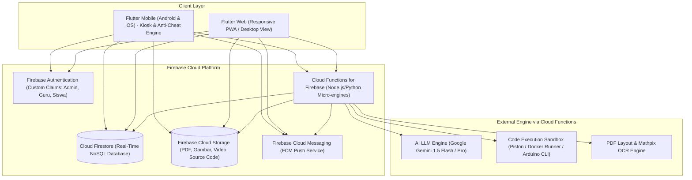
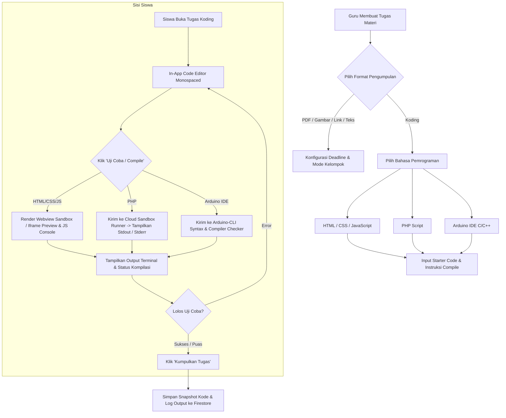
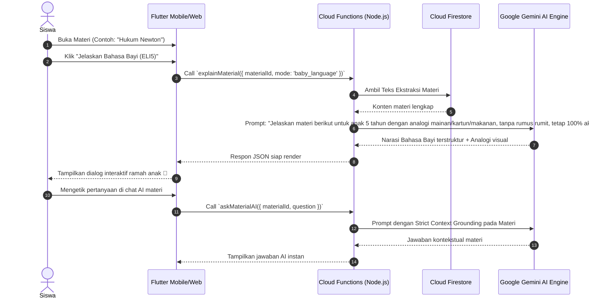
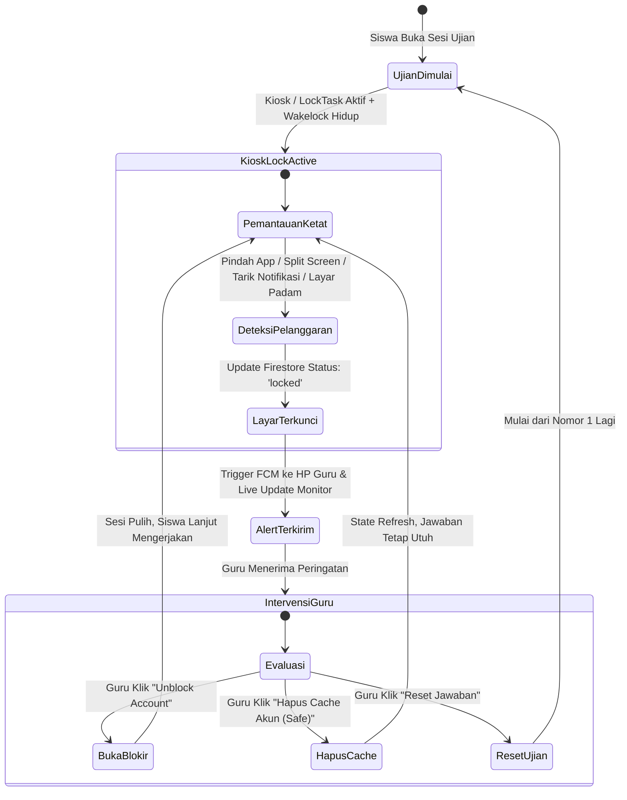
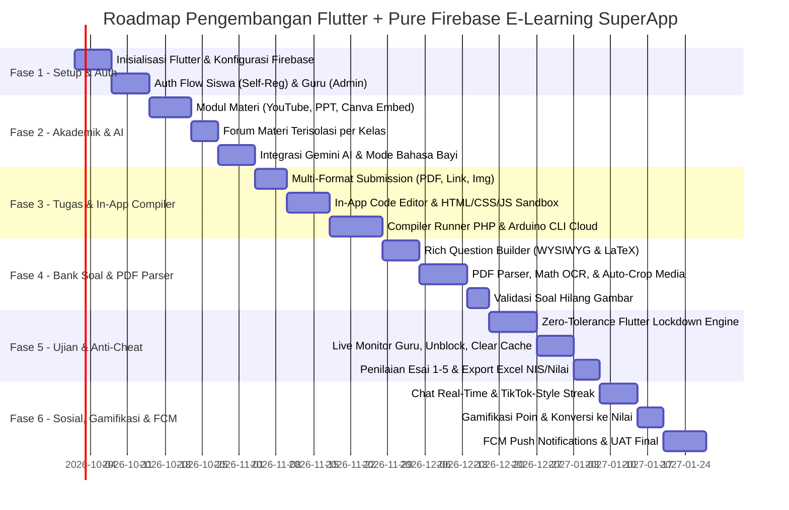

# PRODUCT REQUIREMENT DOCUMENT (PRD)
## Smart E-Learning, AI Tutor, Collaborative Hub, In-App Code Compiler & Secure Exam Engine

---

| Dokumen Versi | Status | Tanggal | Target Platform |
| :--- | :--- | :--- | :--- |
| **v2.0.0 (Pure Firebase & Code Compiler Edition)** | Approved for Development | 15 September 2026 | **Flutter** (Android, iOS, Web) + **Firebase Ecosystem** (Firestore, Functions, Auth, Storage, FCM) + **AI & Compiler Engine** |

---

## DAFTAR ISI
1. [Ringkasan Eksekutif & Visi Produk](#1-ringkasan-eksekutif--visi-produk)
2. [Arsitektur & Tech Stack Terpilih (Flutter + Pure Firebase)](#2-arsitektur--tech-stack-terpilih-flutter--pure-firebase)
3. [User Roles & Autentikasi](#3-user-roles--autentikasi)
4. [Spesifikasi Fungsional: Role Siswa](#4-spesifikasi-fungsional-role-siswa)
5. [Spesifikasi Fungsional: Role Guru](#5-spesifikasi-fungsional-role-guru)
6. [Engine Khusus 1: Multi-Format Assignment & In-App Code Compiler](#6-engine-khusus-1-multi-format-assignment--in-app-code-compiler)
7. [Engine Khusus 2: Advanced AI Tutor & Simplified "Bahasa Bayi"](#7-engine-khusus-2-advanced-ai-tutor--simplified-bahasa-bayi)
8. [Engine Khusus 3: Smart PDF Question Extractor & Math OCR](#8-engine-khusus-3-smart-pdf-question-extractor--math-ocr)
9. [Engine Khusus 4: Zero-Tolerance Anti-Cheat Exam Engine](#9-engine-khusus-4-zero-tolerance-anti-cheat-exam-engine)
10. [Engine Khusus 5: Gamifikasi, Streak & Konversi Poin ke Nilai](#10-engine-khusus-5-gamifikasi-streak--konversi-poin-ke-nilai)
11. [Struktur Data Cloud Firestore & Skema Database](#11-struktur-data-cloud-firestore--skema-database)
12. [Spesifikasi Cloud Functions & Real-Time Sync](#12-spesifikasi-cloud-functions--real-time-sync)
13. [Spesifikasi Notifikasi Firebase Cloud Messaging (FCM)](#13-spesifikasi-notifikasi-firebase-cloud-messaging-fcm)
14. [Kebutuhan Non-Fungsional (Security Rules, Reliability, Performance)](#14-kebutuhan-non-fungsional-security-rules-reliability-performance)
15. [Rencana Rilis & Milestone Pengembangan](#15-rencana-rilis--milestone-pengembangan)

---

## 1. Ringkasan Eksekutif & Visi Produk

### 1.1 Visi Produk
Menciptakan ekosistem superapp edukasi modern berbasis **Flutter** dan **Firebase** murni tanpa server monolitik, yang mengintegrasikan:
1. **Pembelajaran Multi-Media & AI Interaktif**: Penyampaian materi (YouTube, PPT, Canva Embed interaktif dengan navigasi slide native) dipadukan dengan asisten AI materi kontekstual dan fitur revolusioner *"Bahasa Bayi / ELI5 (Explain Like I'm 5)"*.
2. **Pengumpulan Tugas Multi-Format & Built-in Code Compiler**: Fleksibilitas format tugas (PDF, Link, Gambar, Teks) dan **IDE Koding Terintegrasi** (HTML, CSS, JavaScript, PHP, serta Arduino IDE C/C++) di mana siswa dapat mengompilasi, menjalankan (*run/preview*), dan menguji coba kode secara langsung di aplikasi sebelum dikumpulkan.
3. **Keterlibatan Sosial & Gamifikasi Viral**: Membangun kebiasaan belajar harian melalui *Streak System* ala TikTok (antar siswa-siswa, siswa-guru, dan grup) serta pengumpulan poin aktivitas yang dapat ditukarkan langsung menjadi nilai akademik.
4. **Ujian & Kuis Berintegritas Tinggi**: *Zero-Tolerance Anti-Cheat Engine* pada Flutter Mobile & Web yang mengunci layar secara mutlak (mencegah pindah aplikasi, layar terbelah, panel notifikasi ditarik, maupun layar padam) dengan sistem pemantauan jawaban dan pelanggaran real-time bagi guru.
5. **Bank Soal & Kurikulum Cerdas (CP & TP)**: Manajemen Capaian Pembelajaran (CP) dan Tujuan Pembelajaran (TP), ekstraksi cerdas soal dari PDF (termasuk deteksi equation matematika LaTeX dan auto-crop gambar), validasi soal hilang gambar, serta penilaian hybrid (otomatis untuk non-esai, manual skala 1–5 untuk esai).

---

## 2. Arsitektur & Tech Stack Terpilih (Flutter + Pure Firebase)



### 2.1 Stack Components
* **Frontend Client**: **Flutter 3.x** (Satu codebase untuk Android, iOS, dan Web).
* **Identity & Authentication**: **Firebase Authentication** dengan pengelolaan Custom Claims (`role: 'admin' | 'guru' | 'siswa'`).
* **Real-time Database**: **Cloud Firestore** dengan fitur *Offline Persistence* bawaan dan *Real-time Snapshot Listeners* (menggantikan kebutuhan server WebSocket terpisah).
* **File Storage**: **Firebase Cloud Storage** dengan struktur folder terisolasi per kelas, materi, dan tugas.
* **Push Notifications**: **Firebase Cloud Messaging (FCM)** yang terintegrasi langsung dengan trigger Cloud Functions.
* **Serverless Backend (Cloud Functions)**:
  * Pengendali AI Contextual Grounding & *Bahasa Bayi Explainer*.
  * Cloud Compiler Runner (PHP Sandbox & Arduino CLI verification).
  * Parser PDF Soal, Math OCR, & Auto-crop media.
  * Agregator nilai ujian dan generator ekspor berkas Excel.

---

## 3. User Roles & Autentikasi

### 3.1 Role Matrix

| Fitur / Kemampuan | Siswa | Guru | Administrator |
| :--- | :---: | :---: | :---: |
| Registrasi Mandiri | **Ya** (NIS, Kelas, Nama, Password) | Tidak | Tidak |
| Pembuatan Akun oleh Admin | Opsional | **Ya** (Username & Password) | **Ya** |
| Akses Melihat Kredensial Siswa | Milik sendiri | **Ya** (Melihat NIS & Password siswa binaannya) | **Ya** |
| Mengampu Multi-Mapel | - | **Ya** (Dapat mengampu >1 Mata Pelajaran) | **Ya** |
| Akses Forum Materi | Khusus kelasnya saja | Kelas yang diajarnya | Seluruh kelas |
| Manajemen Soal, CP, & TP | - | **Ya** (Sesuai Mapel yang diampu) | **Ya** |
| Konfigurasi Mode Tugas & Compiler | - | **Ya** (Pilih PDF, Link, Gambar, Teks, Koding) | **Ya** |

### 3.2 Alur Registrasi & Kredensial
1. **Guru**:
   * Akun dibuat oleh Administrator melalui dashboard admin Firebase.
   * Format kredensial: Username unik dan Password.
   * Admin menetapkan daftar `subject_ids` (bisa >1 mata pelajaran) dan daftar `class_ids` (kelas yang diajar) ke dalam metadata profil guru di Firestore.
2. **Siswa**:
   * Siswa melakukan registrasi mandiri pada aplikasi Flutter.
   * Input pendaftaran: **NIS (Nomor Induk Siswa)**, **Pilihan Rombongan Belajar (Kelas)**, **Nama Lengkap**, dan **Password**.
   * Sistem membuat user di Firebase Auth (menggunakan email virtual `nis@elearning.internal` atau custom token) dan menyimpan profil di Firestore `/students/{studentId}`.
   * **Akses Password Siswa oleh Guru**: Profil siswa menyimpan field kredensial awal (`initial_password`) yang dilindungi Firebase Security Rules sehingga hanya dapat dibaca oleh Administrator dan Guru yang mengajar kelas dari siswa bersangkutan (mempermudah penanganan teknis di sekolah).

---

## 4. Spesifikasi Fungsional: Role Siswa

### 4.1 Modul Belajar & Akses Materi Interaktif
1. **Multi-Format Viewer**:
   * **YouTube**: Embed player native/web, bebas iklan luar, resume durasi tonton.
   * **PPT/PDF**: Document viewer dengan render halaman responsif dan pencarian teks.
   * **Canva Embed**: Menampilkan embed Canva interaktif yang dapat di-*next* slide demi slide secara native persis dengan presentasi Canva asli.
2. **AI Study Companion**:
   * Tombol *"Tanya AI Materi Ini"*: Chatbot AI yang dibatasi konteks (*grounded*) hanya pada transkrip/teks materi aktif.
   * Fitur *"Mode Bahasa Bayi"*: Menjelaskan materi sulit dengan analogi anak kecil, cerita kartun, dan bahasa super simpel.
3. **Forum Diskusi Terisolasi per Kelas**:
   * Setiap materi memiliki forum diskusi.
   * **Isolasi Mutlak**: Siswa kelas X-RPL-1 hanya dapat membaca dan mengirim pesan pada forum X-RPL-1. Siswa kelas lain tidak memiliki izin akses Firestore terhadap dokumen forum tersebut.
4. **Pelacak Progres Belajar**:
   * Mencatat durasi dan persentase konsumsi materi secara otomatis ke Firestore.

### 4.2 Modul Pengumpulan Tugas (Individu & Kelompok)
1. **Fleksibilitas Pengumpulan**: Siswa mengumpulkan tugas sesuai format yang ditentukan guru:
   * Berkas PDF.
   * Tautan / Link (GitHub, Figma, URL, dll.).
   * Gambar (Ambil foto kamera langsung / galeri).
   * Teks Jawaban (Rich text editor).
   * **Koding Source Code**: Mengerjakan di editor kode bawaan, menguji coba (*compile/run/preview*), lalu mengirimkan source code beserta hasil outputnya.
2. **Sistem Kelompok Mandiri**:
   * Jika tugas bertipe kelompok dengan kuota $N$ anak per kelompok:
     * Siswa dapat membuat kelompok baru (menjadi ketua) atau memilih nama kelompok yang masih memiliki slot kosong.
     * Siswa yang sudah bergabung ke kelompok tidak dapat memilih kelompok lain kecuali dikeluarkan ketua atau keluar sebelum deadline.
   * Pengumpulan tugas dilakukan oleh perwakilan kelompok.
   * **Sinkronisasi Nilai**: Begitu guru memberikan nilai pada tugas kelompok tersebut, nilai otomatis masuk ke rapor masing-masing anggota kelompok secara individual.

### 4.3 Modul Chat & Viral Streak Engine (TikTok Style)
1. **Chatting Real-Time**:
   * Chat 1-on-1 antar sesama siswa.
   * Chat 1-on-1 siswa dengan guru pengampu.
   * Chat grup belajar / kelompok tugas.
2. **Streak Counter (🔥)**:
   * Api streak bertambah $+1$ jika terjadi interaksi pesan setiap jendela 24 jam.
   * Berlaku untuk: Siswa $\leftrightarrow$ Siswa, Siswa $\leftrightarrow$ Guru, dan Grup Belajar.
   * Push notification FCM otomatis berbunyi 4 jam sebelum streak padam.

### 4.4 Modul Gamifikasi & Tukar Poin Jadi Nilai
1. **Perolehan Poin Otomatis**:
   * Menyelesaikan baca materi: $+20$ Poin.
   * Mempertahankan streak harian: $+15$ Poin.
   * Mengumpulkan tugas tepat waktu: $+50$ Poin.
   * Berhasil mengompilasi kode tanpa error: $+10$ Poin.
2. **Penukaran Poin ke Nilai Akademik**:
   * Siswa membuka menu *"Tukar Poin"*, memilih mata pelajaran tujuan, dan menukarkan saldo poinnya secara langsung.
   * Nilai bonus langsung otomatis ditambahkan ke akumulasi nilai tugas siswa bersangkutan di Firestore.

### 4.5 Modul Ujian & Kuis (Siswa)
1. Pengerjaan soal: Pilihan Ganda, Pilihan Ganda Kompleks (Multi), Benar/Salah, Menjodohkan (Matching), dan Esai.
2. Formula matematika dirender mulus menggunakan KaTeX.
3. Terkunci dalam mode anti-kecurangan mutlak (*Zero-Tolerance Lockdown*).

---

## 5. Spesifikasi Fungsional: Role Guru

### 5.1 Multi-Mapel & Manajemen Siswa
1. Guru dapat mengelola lebih dari satu mata pelajaran.
2. **Daftar Siswa Binaan**: Guru dapat melihat seluruh siswa di kelas yang diajarnya, lengkap dengan informasi:
   * Nama Lengkap.
   * NIS.
   * **Password Akun Siswa** (untuk membantu siswa yang lupa sandi di sekolah).
   * Nilai Mata Pelajaran berjalan.

### 5.2 Manajemen CP (Capaian Pembelajaran) & TP (Tujuan Pembelajaran)
1. Guru dapat menambah, mengubah, dan menghapus data CP dan TP untuk setiap mata pelajaran yang diampu.
2. Seluruh butir soal di bank soal terhubung dengan hierarki: **Mapel $\rightarrow$ CP $\rightarrow$ TP**.
3. **Smart Pool Soal**: Guru dapat menarik (*bulk import*) soal-soal dari CP yang telah dibuat sebelumnya ke dalam ujian/kuis baru tanpa harus menginput ulang satu per satu.

### 5.3 Pembuat Soal Mutakhir (Word-like WYSIWYG & Equation LaTeX)
1. **5 Tipe Soal**: Single Choice, Multi Choice, Benar/Salah, Menjodohkan, dan Esai (skala penilaian 1–5).
2. **Editor Soal Seperti Word**:
   * Styling teks (Bold, Italic, Lists, Colors, Tables).
   * Drag & drop insert gambar langsung dari clipboard atau galeri.
   * **Visual Math Equation Editor**: Tombol pintas formula matematika ($\frac{a}{b}$, $\sqrt{n}$, $\sum$, integral, matriks, limit, pangkat/indeks) yang otomatis menghasilkan sintaks LaTeX valid.

### 5.4 Ekstraksi Soal PDF Cerdas & Menu Validasi Soal Tanpa Gambar
1. **Upload Soal via PDF**:
   * Guru mengunggah file `.pdf` naskah soal.
   * Cloud Functions mengekstrak butir soal, opsi A–E, mendeteksi formula matematika, serta memotong (*auto-crop*) gambar soal/diagram dan mengunggahnya ke Firebase Storage.
2. **Menu Validasi Soal Bergambar**:
   * Terdapat menu khusus yang memfilter: *"Soal Bergambar Belum Ada Media"*.
   * Mendeteksi soal hasil impor PDF yang mengandung rujukan visual (misal kata: *"gambar berikut"*, *"diagram di samping"*, *"grafik di atas"*) namun tidak terdeteksi gambar pendukungnya.
   * Guru dapat langsung melampirkan gambar yang terlewat dalam satu kali klik.

### 5.5 Manajemen Tugas Fleksibel & Penilaian Koding
1. Saat membuat tugas, guru dapat menentukan format pengumpulan:
   * `[ ]` PDF
   * `[ ]` Link / URL
   * `[ ]` Gambar / Foto
   * `[ ]` Teks Tertulis
   * `[ ]` **Koding** (Pilihan bahasa: HTML, CSS, JavaScript, PHP, Arduino IDE)
2. Untuk tugas koding, guru dapat menyertakan *Starter Code / Template Kode* dan menentukan *Compiler Check*.
3. Saat menilai tugas koding, guru disajikan antarmuka *Code Diff / Code Viewer* dengan penyorotan sintaks (*syntax highlighting*), melihat hasil eksekusi/output uji coba siswa, dan memberikan feedback per baris kode.
4. **Download Nilai Excel**:
   * Tombol unduh hasil nilai tugas maupun ujian.
   * Berkas Excel digenerate langsung oleh Cloud Functions dengan format bersih dan spesifik: **Hanya berisi kolom NIS dan Nilai Siswa**.

### 5.6 Ruang Pantau Real-Time Ujian (Live Exam Monitor)
1. **Live Grid Jawaban**: Guru memantau pengerjaan seluruh siswa per nomor secara real-time via Firestore snapshot listeners.
2. **Fitur Pengawasan**:
   * **Toggle Sakelar Anti-Cheat**: Menyalakan atau mematikan deteksi kecurangan saat ujian berjalan.
   * **Buka Blokir (Unblock)**: Membuka kunci siswa yang terblokir kecurangan agar bisa melanjutkan ujian.
   * **Hapus Cache Akun (Soft Session Refresh)**: Merefresh koneksi atau state perangkat siswa yang error/lag tanpa menghapus jawaban yang sudah disimpan.
   * **Reset Jawaban**: Mengosongkan lembar jawaban siswa untuk mengulang dari awal jika diperlukan.
3. **Notifikasi Pelanggaran Instan**: HP Guru otomatis menerima notifikasi FCM dan peringatan visual merah di dashboard saat ada siswa yang terdeteksi melakukan pelanggaran layar.

### 5.7 Penilaian Esai Bertingkat (Skala 1 - 5)
1. Nilai soal non-esai dihitung otomatis oleh sistem segera setelah siswa menyelesaikan ujian.
2. Untuk soal esai:
   * Guru membuka lembar esai siswa.
   * Guru memberikan nilai dengan skala angka **1 sampai 5** pada setiap butir soal.
3. Sistem secara otomatis menggabungkan nilai non-esai dan nilai esai terbobot menjadi nilai akhir total 0–100.

---

## 6. Engine Khusus 1: Multi-Format Assignment & In-App Code Compiler

Fitur ini memberikan keleluasaan penuh bagi guru dalam menentukan metode pengumpulan tugas, terutama pada mata pelajaran Pemrograman, Web Development, Informatika, dan Robotika/IoT.



### 6.1 Matriks Bahasa & Mekanisme Compiler / Runner

| Bahasa | Lingkungan Eksekusi | Mekanisme Compiler & Preview | Output yang Ditampilkan ke Siswa |
| :--- | :--- | :--- | :--- |
| **HTML & CSS** | In-App Webview / Sandboxed DOM | Real-time DOM renderer dengan isolasi security sandbox (`allow-scripts` terkontrol). | Pratinjau visual halaman web responsif secara interaktif. |
| **JavaScript** | Local JS Sandbox Engine / V8 Worker | Eksekusi script terisolasi dengan intercept `console.log`, `console.error`, dan `console.warn`. | Terminal log console interaktif + interaksi DOM jika digabung dengan HTML. |
| **PHP** | Cloud Function / Containerized Micro-Runner | Script dikirim ke serverless sandbox container (PHP 8.2 CLI), dieksekusi dengan timeout maksimal 5 detik dan memori dibatasi 64MB. | Output teks `stdout`, error `stderr`, dan return status code. |
| **Arduino IDE (C/C++)** | Arduino CLI Cloud Service / WebAssembly AVR | Kode sketch `.ino` diperiksa sintaksisnya menggunakan **Arduino CLI** (Board Target: Arduino Uno / ESP32). Memvalidasi struktur `setup()`, `loop()`, library header `#include`, dan memori flash. | Status kompilasi: `"Compilation Successful! Sketch uses X bytes (Y%)"` atau pesan error baris compiler (misal: `"missing ';' before '}' on line 14"`). |

### 6.2 Integritas Pengumpulan Koding
* Siswa tidak hanya mengumpulkan teks kode, tetapi sistem juga mencatat:
  1. File source code utama (`index.html`, `script.js`, `main.php`, atau `sketch.ino`).
  2. Log hasil uji coba terakhir (status kompilasi dan waktu pengujian).
  3. Status lolos uji compiler sebelum tombol submit dibuka.

---

## 7. Engine Khusus 2: Advanced AI Tutor & Simplified "Bahasa Bayi"



---

## 8. Engine Khusus 3: Smart PDF Question Extractor & Math OCR

1. **Unggah & Parsing Dokumen**:
   * Guru mengunggah file PDF bank soal ke Cloud Storage.
   * Trigger Cloud Functions memproses PDF:
     * **Deteksi Teks & Opsi**: Regex layout analysis untuk nomor soal (1, 2, 3...) dan opsi jawaban ($A, B, C, D, E$).
     * **Mathpix / Math OCR**: Mendeteksi formula matematika seperti matriks, akar kuadrat, integral, pecahan bertingkat, lalu mengonversinya menjadi teks format **LaTeX/KaTeX**.
     * **Auto-Crop Image**: Koordinat *bounding box* gambar/diagram pada PDF dipotong otomatis menjadi berkas gambar terpisah, disimpan ke Firebase Storage, dan URL-nya ditautkan ke butir soal terkait.
2. **Fitur Validasi Soal Tanpa Gambar**:
   * Sistem melakukan pemindaian kata kunci bahasa Indonesia (*"perhatikan gambar"*, *"pada gambar"*, *"grafik berikut"*, *"diagram di bawah"*).
   * Jika kata kunci ditemukan namun tidak ada gambar yang terpotong dari PDF, butir soal otomatis diberi tanda: `missing_image_flag: true`.
   * Guru memiliki menu terpisah untuk mengunggah gambar pengganti secara cepat.

---

## 9. Engine Khusus 4: Zero-Tolerance Anti-Cheat Exam Engine



### 9.1 Mekanisme Teknis Kunci Perangkat di Flutter
* **Anti App-Switch & Minimize**: Menggunakan `WidgetsBindingObserver` pada `didChangeAppLifecycleState`. Jika status berubah menjadi `inactive`, `paused`, atau `detached`, sesi ujian langsung terkunci dalam $0$ milidetik.
* **Anti Split-Screen & Floating Apps**: Deteksi ukuran *viewport* secara ketat. Perubahan ukuran jendela di luar rotasi resmi layar memicu event penguncian.
* **Anti Panel Notifikasi (Notification Shade Interception)**: Menjalankan Android Kiosk Mode / LockTask (`startLockTask()`) dan iOS Guided Access API.
* **Anti Layar Padam (Screen Sleep)**: Mengaktifkan `wakelock_plus` sepanjang pengerjaan ujian.
* **Anti Screenshot / Screen Recording**: Mengaktifkan flag `FLAG_SECURE` pada Android dan perlindungan layer native iOS sehingga tangkapan layar menghasilkan layar hitam pekat.

---

## 10. Engine Khusus 5: Gamifikasi, Streak & Konversi Poin ke Nilai

### 10.1 Streak System (TikTok Style)
1. Setiap obrolan atau interaksi belajar dalam jendela 24 jam memperbarui status streak.
2. Ikon Api 🔥 muncul beserta angka hari berturut-turut.
3. Kategori Streak:
   * **Siswa $\leftrightarrow$ Siswa**: Kolaborasi belajar antar rekan sekelas.
   * **Siswa $\leftrightarrow$ Guru**: Konsultasi bimbingan akademik dengan guru pengampu.
   * **Grup Streak**: Partisipasi kelompok belajar harian.
4. FCM Push Notification otomatis mengingatkan pengguna jika sisa waktu tinggal 4 jam sebelum api padam.

### 10.2 Mekanisme Tukar Poin Jadi Nilai
1. Siswa mengumpulkan poin dari berbagai aktivitas positif (membaca materi, menyelesaikan kuis, kompilasi kode sukses, menjaga streak).
2. Siswa membuka tab *"Tukar Poin"*, memilih mata pelajaran, dan menukarkan poin dengan rasio yang ditetapkan (contoh: 100 poin = $+1$ nilai tugas, maksimal $+10$ nilai bonus per semester).
3. Cloud Functions secara otomatis mengkreditkan nilai ke kartu nilai siswa dan mendebet saldo poin untuk menjaga integritas data.

---

## 11. Struktur Data Cloud Firestore & Skema Database

Struktur koleksi NoSQL Firestore dirancang optimal untuk query cepat, isolasi keamanan per kelas, dan dukungan real-time.

```
firestore-root
│
├── /users/{userId}                           // Profil Guru & Admin
│     ├── username: string
│     ├── role: 'admin' | 'guru'
│     ├── full_name: string
│     ├── subject_ids: array<string>         // Guru dapat mengajar >1 mapel
│     ├── class_ids: array<string>           // Daftar kelas yang diajar
│     └── fcm_token: string
│
├── /students/{studentId}                     // Profil Siswa (Registrasi Mandiri)
│     ├── nis: string (unique)
│     ├── full_name: string
│     ├── class_id: string                   // ID Kelas
│     ├── initial_password: string           // Kredensial awal (dapat dibaca guru/admin)
│     ├── total_points: number
│     ├── fcm_token: string
│     └── created_at: timestamp
│
├── /subjects/{subjectId}                     // Master Mata Pelajaran
│     ├── name: string
│     └── code: string
│
├── /curriculum_cps/{cpId}                    // Capaian Pembelajaran
│     ├── subject_id: string
│     ├── teacher_id: string
│     ├── code: string                       // Contoh: CP-MTK-10.1
│     └── description: string
│
├── /curriculum_tps/{tpId}                    // Tujuan Pembelajaran
│     ├── cp_id: string
│     ├── subject_id: string
│     ├── code: string
│     └── description: string
│
├── /question_bank/{questionId}               // Bank Soal Terintegrasi
│     ├── subject_id: string
│     ├── cp_id: string
│     ├── tp_id: string
│     ├── question_type: 'single'|'multi'|'true_false'|'matching'|'essay'
│     ├── content_html: string               // Format WYSIWYG
│     ├── equation_latex: string
│     ├── has_image: boolean
│     ├── image_urls: array<string>
│     ├── missing_image_flag: boolean        // Flag validasi soal hilang gambar
│     ├── options: array<map>
│     ├── correct_answers: map
│     └── essay_rubric: { max_score: 5 }     // Skala 1-5
│
├── /materials/{materialId}                   // Modul Materi Belajar
│     ├── subject_id: string
│     ├── teacher_id: string
│     ├── class_ids: array<string>
│     ├── title: string
│     ├── content_type: 'youtube' | 'ppt' | 'canva'
│     ├── media_url: string                  // URL Video / PPT / Canva Embed
│     ├── ai_context_summary: string
│     │
│     ├── /forums/{forumId}                  // Forum Sub-koleksi
│     │     ├── class_id: string             // Strict security isolation
│     │     ├── sender_id: string
│     │     ├── sender_name: string
│     │     ├── message: string
│     │     └── created_at: timestamp
│     │
│     └── /assignments/{assignmentId}        // Tugas Terintegrasi Materi
│           ├── title: string
│           ├── type: 'individual' | 'group'
│           ├── max_group_members: number
│           ├── allowed_submission_types: array<'pdf'|'link'|'image'|'text'|'code'>
│           ├── code_config: {               // Konfigurasi jika ada opsi koding
│           │     allowed_languages: ['html', 'css', 'js', 'php', 'arduino'],
│           │     starter_code: string,
│           │     require_successful_compile: boolean
│           │   }
│           ├── deadline: timestamp
│           │
│           └── /submissions/{submissionId}  // Pengumpulan Tugas
│                 ├── group_id: string (nullable)
│                 ├── submitter_id: string
│                 ├── member_student_ids: array<string>
│                 ├── submission_type: string
│                 ├── payload: {             // Fleksibel sesuai tipe
│                 │     pdf_url?: string,
│                 │     link_url?: string,
│                 │     image_urls?: array<string>,
│                 │     text_content?: string,
│                 │     code?: {
│                 │       language: string,
│                 │       source_files: map,
│                 │       last_compile_log: string,
│                 │       compile_status: 'success' | 'failed'
│                 │     }
│                 │   }
│                 ├── score: number (nullable)
│                 └── graded_at: timestamp
│
├── /exams/{examId}                           // Ujian / Kuis
│     ├── subject_id: string
│     ├── teacher_id: string
│     ├── class_ids: array<string>
│     ├── title: string
│     ├── anti_cheat_enabled: boolean        // Global Toggle Pengawas
│     ├── question_ids: array<string>
│     ├── duration_minutes: number
│     │
│     └── /sessions/{sessionId}              // Monitoring Live Ujian
│           ├── student_id: string
│           ├── student_name: string
│           ├── status: 'in_progress' | 'locked' | 'completed'
│           ├── current_question_index: number
│           ├── answers: map<questionId, answerData>
│           ├── violation_count: number
│           ├── last_violation_reason: string
│           ├── non_essay_score: number
│           ├── essay_score: number
│           ├── final_score: number
│           └── updated_at: timestamp
│
├── /streaks/{streakId}                       // Streak Interaksi Belajar
│     ├── type: 'peer' | 'teacher' | 'group'
│     ├── participant_ids: array<string>
│     ├── streak_count: number
│     ├── last_interaction_at: timestamp
│     └── expires_at: timestamp
│
└── /grade_redeems/{redeemId}                 // Log Penukaran Poin ke Nilai
      ├── student_id: string
      ├── subject_id: string
      ├── points_spent: number
      ├── bonus_grade: number
      └── created_at: timestamp
```

---

## 12. Spesifikasi Cloud Functions & Real-Time Sync

### 12.1 Kumpulan Cloud Functions Utama (Node.js/TypeScript)
1. `onStudentRegistered`: Memvalidasi keunikan NIS dan menyinkronkan profil siswa ke Firestore.
2. `explainMaterial`: Memanggil Google Gemini API dengan parameter mode (`baby_language` atau `qna`) menggunakan teks materi yang tersimpan.
3. `parsePdfQuestions`: Memproses naskah soal PDF dari Cloud Storage, menjalankan Math OCR, memotong gambar butir soal otomatis, dan menyimpan butir soal ke koleksi `question_bank`.
4. `runCodeCompiler`: Menerima kode siswa (HTML/CSS/JS, PHP, atau Arduino sketch), menjalankan kompilasi/eksekusi pada sandbox container, dan mengembalikan `stdout`/`stderr` serta status kompilasi.
5. `onExamViolationTriggered`: Firestore trigger saat field `status` pada `/exams/{id}/sessions/{id}` berubah menjadi `'locked'`. Otomatis mengirimkan push notifikasi FCM berprioritas tinggi ke HP guru pengawas.
6. `calculateExamScore`: Menghitung skor otomatis butir non-esai dan mengakumulasikan nilai esai (skala 1–5) setelah dinilai guru.
7. `exportExamGradesToExcel`: Mengambil seluruh sesi ujian siswa yang selesai, memfilter hanya kolom **NIS** dan **Nilai Siswa**, menyusun file `.xlsx`, dan mengembalikan download URL sementara.
8. `checkStreakExpirations`: Cron job terjadwal (Cloud Scheduler) setiap 1 jam untuk mengecek streak yang tersisa 4 jam dan mengirimkan notifikasi peringatan.

---

## 13. Spesifikasi Notifikasi Firebase Cloud Messaging (FCM)

| Trigger Event | Target Penerima | Judul Notifikasi | Isi Pesan | Payload Data |
| :--- | :--- | :--- | :--- | :--- |
| **Materi Baru** | Seluruh siswa di `class_ids` | 📚 Materi Baru Tersedia! | Guru menerbitkan materi baru: [Judul Materi]. Pelajari sekarang! | `{ type: 'material', id: 'mat_123' }` |
| **Tugas Baru** | Seluruh siswa di `class_ids` | 📝 Tugas Baru Diberikan | Ada tugas baru pada materi [Judul]. Format: [Tipe Tugas]. | `{ type: 'assignment', id: 'asg_456' }` |
| **Siswa Terblokir Ujian** | Guru Pengampu Ujian | 🚨 Pelanggaran Ujian! | Siswa [Nama Siswa] ([Kelas]) terdeteksi curang dan terblokir! | `{ type: 'exam_monitor', session_id: 'ses_789' }` |
| **Chat Masuk** | Penerima Chat | 💬 Pesan Baru | [Nama Pengirim]: [Cuplikan Pesan] | `{ type: 'chat', chat_id: 'cht_001' }` |
| **Peringatan Streak** | Peserta Streak | 🔥 Streak Kamu Hampir Padam! | Sisa 4 jam lagi untuk menjaga api streak dengan [Nama/Grup]! | `{ type: 'streak', streak_id: 'str_101' }` |

---

## 14. Kebutuhan Non-Fungsional (Security Rules, Reliability, Performance)

### 14.1 Firestore Security Rules Architecture
1. **Isolasi Forum Kelas**:
   ```javascript
   match /materials/{materialId}/forums/{forumId} {
     allow read, write: if request.auth != null && 
       (request.auth.token.role == 'guru' || 
        request.auth.token.class_id == resource.data.class_id || 
        request.auth.token.class_id == request.resource.data.class_id);
   }
   ```
2. **Proteksi Kunci Jawaban Ujian**:
   * Kunci jawaban soal (`correct_answers`) pada dokumen ujian tidak boleh dapat dibaca oleh siswa saat sesi ujian berlangsung. Siswa hanya diizinkan membaca dokumen `/question_bank` dengan proyeksi field tanpa kunci jawaban.
3. **Kerahasiaan Password Siswa**:
   * Field `initial_password` pada dokumen `/students/{studentId}` hanya dapat dibaca oleh Admin dan Guru yang memiliki `class_ids` bersesuaian.

### 14.2 Performa & Offline Resilience
1. **Firestore Offline Cache**: Flutter mengaktifkan `persistenceEnabled: true`. Jawaban kuis disimpan di cache lokal terlebih dahulu sebelum di-*sync* ke server saat jaringan tidak stabil.
2. **Rate Limiting Compiler**: Cloud Function `runCodeCompiler` dibatasi maksimal 1 eksekusi per 3 detik per siswa untuk mencegah penyalahgunaan resource kompilasi.

---

## 15. Rencana Rilis & Milestone Pengembangan



---
*Dokumen ini merupakan panduan spesifikasi arsitektur final untuk implementasi Flutter & Firebase SuperApp.*
